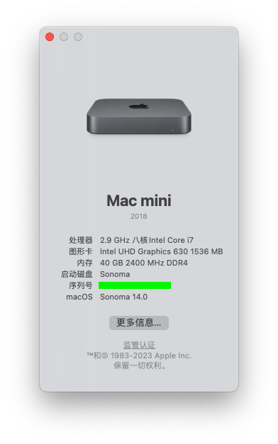

<!--
 * @Author: Leslie
 * @Date: 2022-08-02 17:39:17
 * @LastEditors: Leslie
 * @LastEditTime: 2022-08-02 19:20:13
 * @FilePath: /undefined/Users/leslie/Desktop/Mac EFI Tools/Hackintosh/HP-ProDesk-680-G6-Hackintosh/README.md
 * @Description: 
 * 
 * Copyright (c) 2022 by LeslieD, All Rights Reserved. 
-->
# HP-ProDesk-680-G6-Hackintosh

### 硬件配置

处理器：Intel Core i7-10700

芯片组：Intel Q470

内存：24G DDR4 2400 * 3

显卡：UHD630

声卡：ALC222

网卡：Intel I219LM11

无线网卡：BCM94360CD with NGFF Adapter

> 自带硬盘为三星PM991 不支持黑苹果 需更换

硬盘：WD_BLACK SN750 256G

### 目前问题

1、机箱后的耳机孔未生效

2、风扇转速不显示

